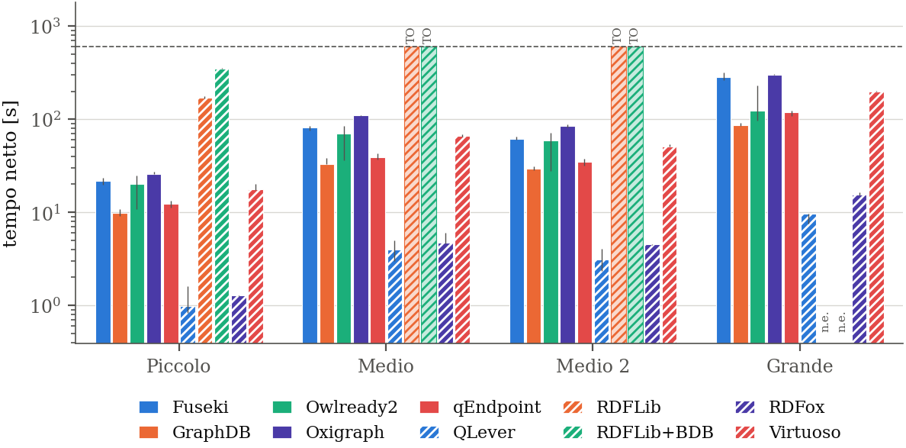
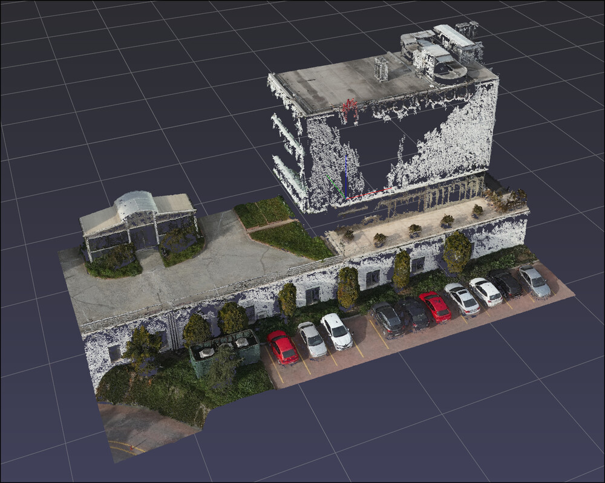
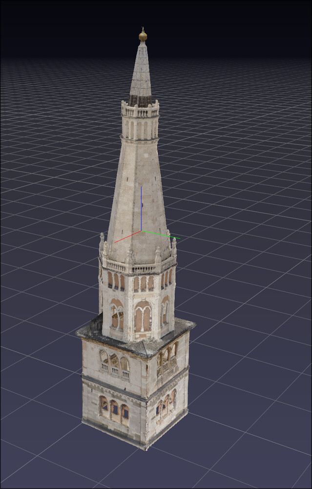
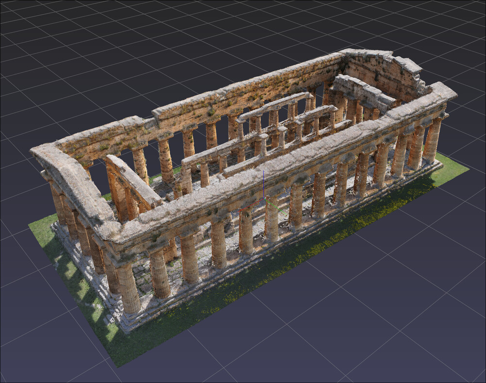

# kbench

**A resumable benchmark harness for RDF knowledge stores.**

kbench runs the same SPARQL queries across eleven triple stores and four datasets over a
uniform HTTP interface, and writes machine-readable results. Ten of the eleven are in the
thesis run; the eleventh, stardog, needs a licence. Every engine is normalised to an HTTP
SPARQL endpoint, so the client-side path (send, execute, receive, parse) is identical and
comparable across engines that are otherwise a native binary, a container, or an in-process
library.

It is the benchmarking companion to the [3DOnt](https://3dom.fbk.eu/projects/3DOnt) viewer: the query set and the
per-dataset ontology namespaces come from there. The results are written up in
[`thesis/`](thesis/).



*One chart kbench produces: the `select_all` query — every point's coordinates and colour —
across ten engines and four datasets. Log axis, median of 8 repetitions net of each engine's
connection floor, error bars over the repetitions. `TO` marks a timeout, `n.e.` a pair that
was never run. QLever and RDFox stay an order of magnitude or more below the rest.*

## Quick start

Everything is pinned with Nix — no other setup, no system packages to install.

```bash
nix develop                      # or: direnv allow

python -m bench list-engines     # what can run on this machine
python -m bench list-datasets    # what data is present locally
python -m bench list-queries

python -m bench run    --config bench.toml           # run the benchmark
python -m bench status --run-dir runs/default        # progress so far
python -m bench resume --run-dir runs/default        # continue after Ctrl-C
python -m bench report --run-dir runs/default --format csv
```

The dev shell brings the native engines (oxigraph, Jena/Fuseki, qEndpoint, qLever), a
Docker client for the containerised ones, and the full LaTeX toolchain. `pyproject.toml`
also declares a `kbench` console script, which is what you get after `pip install -e .`;
inside the dev shell, `python -m bench` is the invocation that always resolves.

Build the thesis PDF:

```bash
nix build .#thesis               # -> result/facenda_thesis.pdf
```

Some engines need credentials or licence files, and some datasets are large local files
that are never copied into the repo — see [docs/engines.md](docs/engines.md) and
[docs/datasets.md](docs/datasets.md). Machine-local settings (licence paths, the identity
of non-disclosable datasets) go in a gitignored `.env`, loaded automatically by direnv.

## The data

Datasets are point clouds published as RDF by [3DOnt](https://3dom.fbk.eu/projects/3DOnt) — one graph per site,
11M to 157M triples, queried the way the viewer queries them.

<table>
  <tr>
    <td width="33%"></td>
    <td width="33%"></td>
    <td width="33%"></td>
  </tr>
  <tr>
    <td><b>Piccolo</b> — Davutpasa campus, YTU3D.<br>1.07M points, 11.7M triples.</td>
    <td><b>Medio</b> — Ghirlandina tower, Modena.<br>3.72M points, 38.9M triples.</td>
    <td><b>Medio 2</b> — Temple of Neptune, Paestum.<br>2.79M points, 47.2M triples.</td>
  </tr>
</table>

A fourth and larger dataset (9.81M points, 157M triples) is benchmarked as **Grande**; its
contents are not disclosable, so it has no picture here and is referred to only by that name.

## Documentation

| Page | What is in it |
|---|---|
| [What it measures](docs/measurements.md) | The metrics, and why each engine is queried in the result format it emits fastest |
| [Configuration](docs/configuration.md) | `bench.toml` reference, per-engine memory budgeting, resumability |
| [Engines](docs/engines.md) | The ten engines, how each is packaged, how to add one |
| [Queries and datasets](docs/datasets.md) | Query templates, what a dataset is, preparing the source graphs |
| [Thesis output](docs/thesis.md) | Turning a finished run into charts and LaTeX |
| [Known limitations](docs/notes.md) | What to know before trusting a number |

## Layout

```
bench/
  __main__.py     CLI
  config.py       BenchConfig (TOML)
  datasets.py     dataset descriptors
  queries/        query registry + builtins
  engines/        AbstractEngine, registry, http client, one module per engine
  servers/        in-process HTTP wrappers for the embedded engines
  metrics.py      timing, RSS sampler, disk usage
  store.py        SQLite persistence (resumable)
  runner.py       sequential orchestration
  tuning.py       one memory budget per engine, derived from system RAM
  report.py       CSV / JSON / parquet export
  thesis_export.py  full result grid (missing cells explained) for the thesis
  thesis_charts.py  matplotlib PNG charts
  thesis_tables.py  generated LaTeX (figure floats + appendix tables)
  tui.py          rich progress + plain fallback
docs/             the pages linked above
nix/              custom derivations (qendpoint, qlever-control) copied from 3DOnt
thesis/           the LaTeX thesis; `generated/` and `images/plots/` come from a run
```
